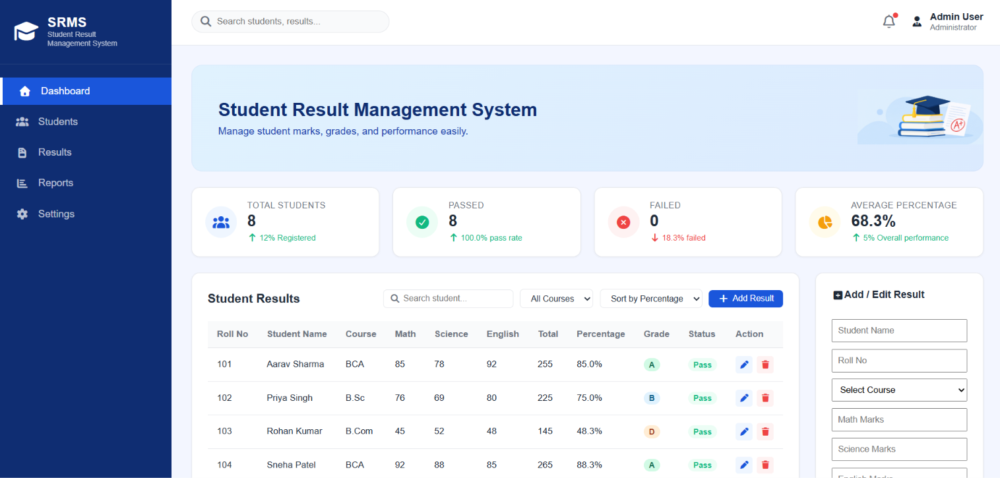
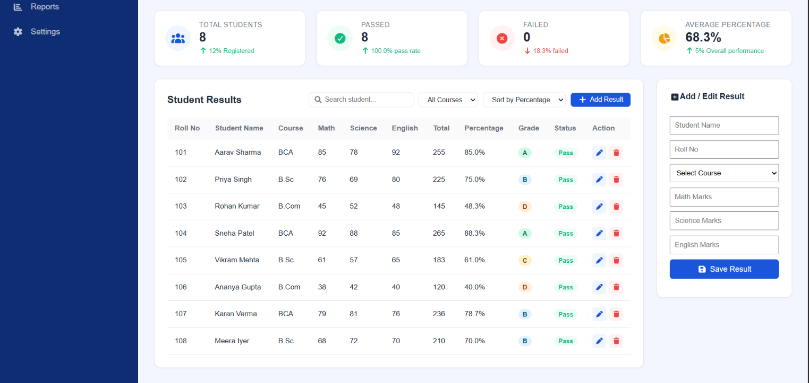

# 🎓 Student Result Management System

A simple and user-friendly **Student Result Management System** developed using HTML, CSS, and JavaScript.

This project is designed to manage and display student result information through an interactive web interface.

## ✨ Features

-  Student result management
-  Student information display
-  Result calculation
-  Easy-to-use interface
-  Responsive design
-  Clean and user-friendly UI

## 🛠️ Technologies Used

- HTML5
- CSS3
- JavaScript
- Responsive Web Design

## 📸 Screenshots

### Dashboard

### Student Results

## 📂 Project Structure

Student-Result-Management/
│
├── Images-used/
│   └── Project images and assets
│
├── Output/
│   └── Project screenshots
│
├── index.html
├── style.css
└── script.js

## 👩‍💻 Developed By

**Vibhuti Gadhvi**

GitHub: [@vibhutigadhvi36](https://github.com/vibhutigadhvi36)
